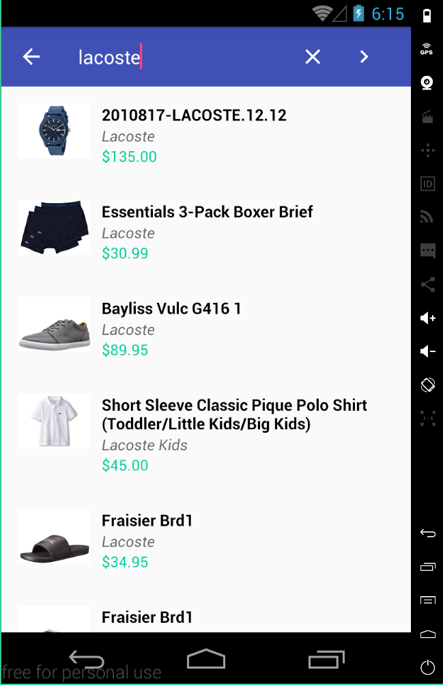

# Ecommerce-Retrofit
Android Ecommerce example using [Data binding](https://developer.android.com/topic/libraries/data-binding/index.html), [Retrofit](https://square.github.io/retrofit/) and [Picasso](http://square.github.io/picasso/) from Square.

The data are pulled from Zappos website. An example API call can be like [this](https://api.zappos.com/Search?term=nike&key=b743e26728e16b81da139182bb2094357c31d331)

apk files are located in the root directory
